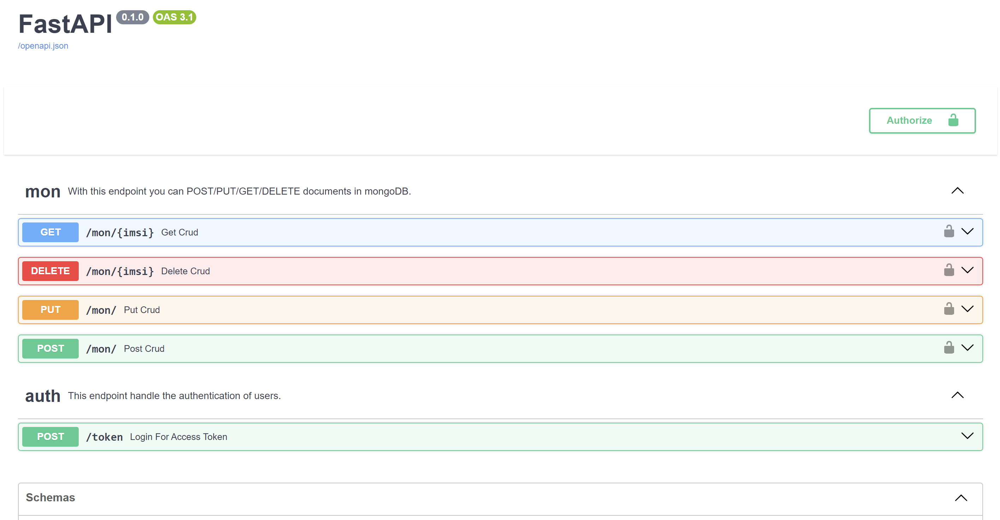

# Costum MongoDB WebUI with authentication by bladerunner
A UI powered by **FastAPI**. You can manage MongoDB database via CRUD endpoints.

## Endpoints
1. MongoDB CRUD 🏠
2. Authentication 💻

## How does it works?
## Run with docker:
Run the following command in the project root:
```bash
# clone the project
git clone [https://git@git.siz-tel.com:2222/bladerunner/MongoDB_WebUI_UPDATED.git](https://github.com/Bladerunner2014/waste_management.git)

# or usin ssh
git clone git@github.com:Bladerunner2014/waste_management.git

cd MongoDB_WebUI_UPDATED

# run project with docker and docker-compose
docker-compose up -d
```
This command will build container image and run it on 8008 port. you can change the listening port in docker-compose file by changing the 8008 in ports section:
```bash
version: '3'

services:
  web:
    build: .
    command: uvicorn main:app --host 0.0.0.0
    volumes:
      - .:/infra
    ports:
      - "8008:8000"
```


## Run bare metal on your machine:
Run the following command in the project root:
```bash
uvicorn main:app --reload
```
**Note:**
Dont use --reload in production!


## API documents are available in swagger:
After running the app, open the following address in your browser:
```bash
http://127.0.0.1:8000/docs
```
**Note:**
Change the host and port with your costum host and port. You should see the following page containing the API documents:
<p align="center">

</p>


# License
[](./LICENSE)
